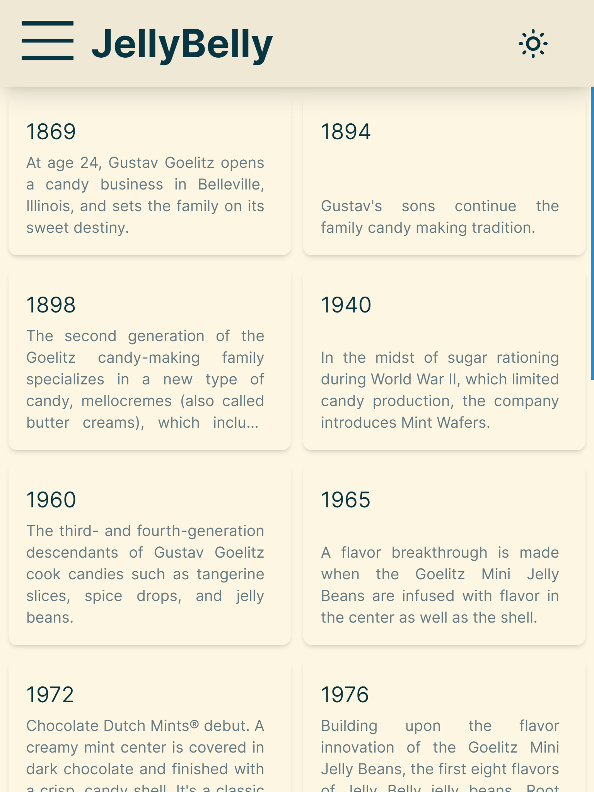

# JellyBelly Wiki
> JellyBelly Wiki - сайт о бобах JellyBelly

### Посмотрите [Live Demo](https://jelly-belly-wiki.vercel.app)!

## Стек
- TypeScript
- React 18
- Next.js 14 (App Router)
- Tailwind CSS
- Zod
- next-themes

## О проекте
- Написан за 10 часов, в качестве тестового задания перед собеседованием
- Основан на открытом API https://jelly-belly-wiki.netlify.app
- Server Side Rendering (SSR) - в ответ на запрос пользователя сервер отправляет сгенерированный HTML заполненный контентом, а затем загружается весь необходимый для работы JavaScript. Для пользователя страница загружается быстрее
- Search Engine Optimization (SEO) - благодаря SSR поисковые боты могут индексировать страницы (в отличии от приложений написанных с использованием SPA подхода)
- Адаптивная верстка
  - Поддержка мобильных устройств (в том числе планшетов)
  - Верстка на основе rem
  - Автоматическое масштабирование для малых и больших разрешений (сайт выглядит одинаково при любых разрешениях 16:9)
- Написан в соответствии с [Feature-Sliced Design (FSD)](https://feature-sliced.design/ru/)
- Легко масштабируемый
  - Сущности, для которых необходимо реализовать общий функционал (например ленивую загрузку карточек) объедены абстракцией [item](./src//entities//item/) - это позволяет переиспользовать компонент [Grid](./src/widgets/grid/), а так же писать компоненты обёртки, например [ItemCard](./src/features/itemCard/) или [ItemInfo](./src/features/itemInfo/)
  - Каждой сущности в рамках [item](./src//entities//item/), поставлена в соответствие секция [section](./src/features/sections/) - это позволяет написать переискользуемую страницу [\[section\]](./src/app/%5Bsection%5D/) и динамический [header](./src/widgets/header/)
  - Вместе эти уровни абстракции позволяют, при необходимости, легко добавить новые сущности
- Валидация данных с помощью схем Zod
  - Все данные, полученные с API валидируются с помощью библиотеки Zod
  - При получении списка объектов, каждый валидируется отдельно, в случае возникновения ошибок, бракованный объект удаляется из списка, а остальные данные поступают в рендер - это обеспечивает отказоустойчивость, при единичных ошибках в данных
- Lazy loading - новые карточки подгружаются по мере необходимости при просмотре (скроллинге) страницы
- Используется цветовая схема [Solarized](https://en.wikipedia.org/wiki/Solarized). Есть возможность переключения между тёмной и светлой схемой

## Скриншоты

#### Desktop (HD+)
|||
|-|-|
|||
|||

#### Tablet (iPad)
|||
|-|-|
|||
|||

#### Mobile (iPhoneX)
||||
|-|-|-|
||||

## Запуск
#### Локально
    npm install
    npm run dev